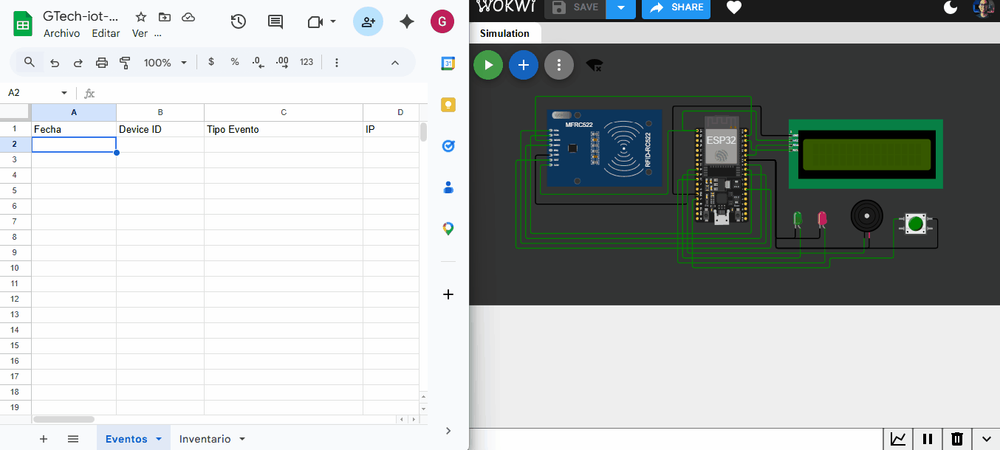
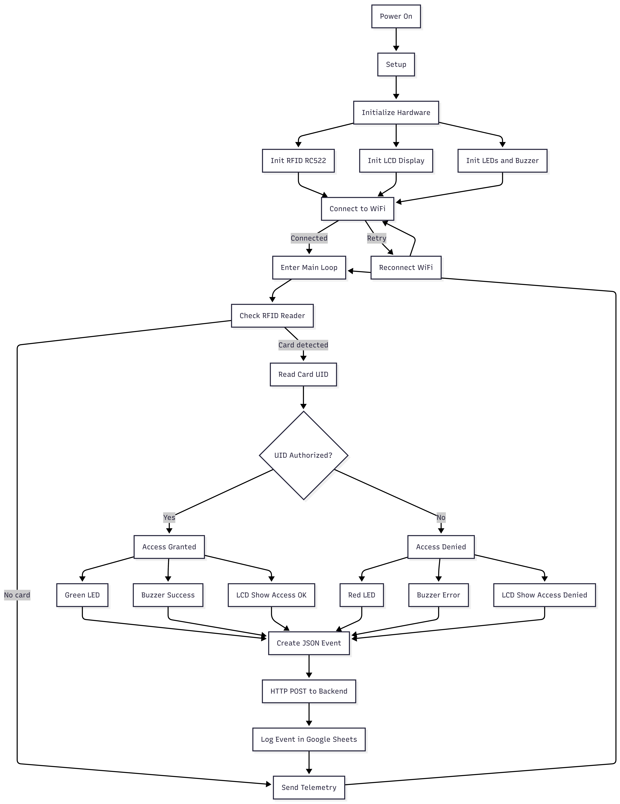
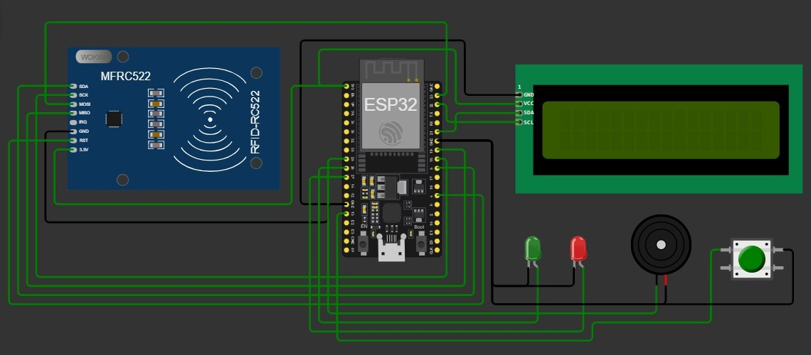

# IoT RFID Access Control System (ESP32)


ESP32-based IoT access control system using RFID cards, a serverless backend with Google Apps Script, and Google Sheets for event logging and monitoring.

This repository demonstrates a complete IoT architecture including firmware, cloud backend integration, and real-time device telemetry.

---

## Documentation

Project documentation is available in two languages:

English
[README_en.md](README_en.md)

Español
[README_es.md](README_es.md)

Additional technical documentation:

System Architecture (English)
[docs/architecture_en.md](docs/architecture_en.md)

Arquitectura del Sistema (Español)
[docs/architecture_es.md](docs/architecture_es.md)

---

## System Demo



This demo shows the complete system workflow:

1. An RFID card is scanned on the ESP32 device
2. The ESP32 sends an HTTP request to the backend
3. Google Apps Script processes the request
4. The event is stored in Google Sheets

---

## System Architecture


This diagram represents the global architecture of the system:

ESP32 Device → HTTP API → Google Apps Script → Google Sheets

The device sends telemetry and RFID events using HTTP POST requests to a serverless backend.

---

## Firmware Architecture


The firmware is structured to handle:

RFID reading
WiFi connectivity
HTTP communication with the backend
Device telemetry and diagnostics

---

## IoT Architecture Overview


This diagram illustrates how the embedded device interacts with the cloud backend and storage layer.

---
## Firmware Flow



---

## Hardware

Hardware documentation:

- [Bill of Materials](hardware/BOM.md)

---

## Hardware Wiring

The following diagram shows the physical wiring of the ESP32 RFID IoT system.



### Pin Connections

| Component    | Pin     | ESP32 GPIO |
| ------------ | ------- | ---------- |
| RFID RC522   | SDA     | GPIO5      |
| RFID RC522   | SCK     | GPIO18     |
| RFID RC522   | MOSI    | GPIO23     |
| RFID RC522   | MISO    | GPIO19     |
| RFID RC522   | RST     | GPIO4      |
| RFID RC522   | VCC     | 3.3V       |
| RFID RC522   | GND     | GND        |
| LCD 16x2 I2C | SDA     | GPIO21     |
| LCD 16x2 I2C | SCL     | GPIO22     |
| LCD 16x2 I2C | VCC     | 3.3V       |
| LCD 16x2 I2C | GND     | GND        |
| Green LED    | Signal  | GPIO26     |
| Green LED    | Cathode | GND        |
| Red LED      | Signal  | GPIO27     |
| Red LED      | Cathode | GND        |
| Buzzer       | Signal  | GPIO25     |
| Buzzer       | GND     | GND        |
| Push Button  | Signal  | GPIO13     |
| Push Button  | GND     | GND        |

### Hardware Components

The hardware setup includes:

* ESP32 microcontroller as the main IoT device
* RFID RC522 module for card detection
* LCD display for system feedback
* LEDs for visual status indicators
* Buzzer for audio alerts
* Push button for optional input

The ESP32 connects to WiFi and sends access events to the backend implemented using Google Apps Script.

---

## Repository Structure

```
iot-rfid-esp32
│
├ firmware/
│   └ esp32-rfid/
│       ├ esp32-rfid.ino
│       └ secrets.example.h
│
├ diagrams/
│   ├ demo.gif
│   ├ device-firmware-architecture-v1-en.png
│   ├ device-firmware-architecture-v1-es.png
│   ├ iot-architecture-v1-en.png
│   ├ iot-architecture-v1-es.png
│   ├ system-architecture-en.png
│   └ system-architecture-es.png
│
├ docs/
│   ├ architecture_en.md
│   └ architecture_es.md
│
├ README.md
├ README_en.md
├ README_es.md
└ .gitignore
```

---

## Configuration

Sensitive configuration values are stored locally and are not included in the repository.

Create the configuration file:

```
cp firmware/esp32-rfid/secrets.example.h firmware/esp32-rfid/secrets.h
```

Then configure:

WiFi credentials
Google Apps Script endpoint
Google Sheet ID

---

## Technology Stack

| Layer           | Technology           |
| --------------- | -------------------- |
| Firmware        | Arduino Framework    |
| Microcontroller | ESP32                |
| Communication   | HTTP REST            |
| Backend         | Google Apps Script   |
| Data Storage    | Google Sheets        |
| Interface       | LCD I2C + RFID RC522 |

---

## License

MIT License
