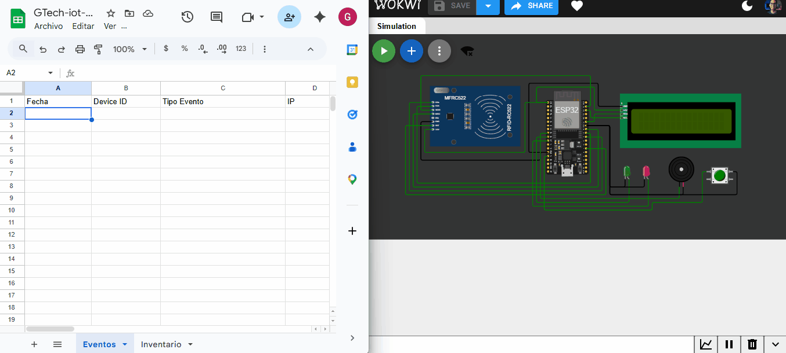
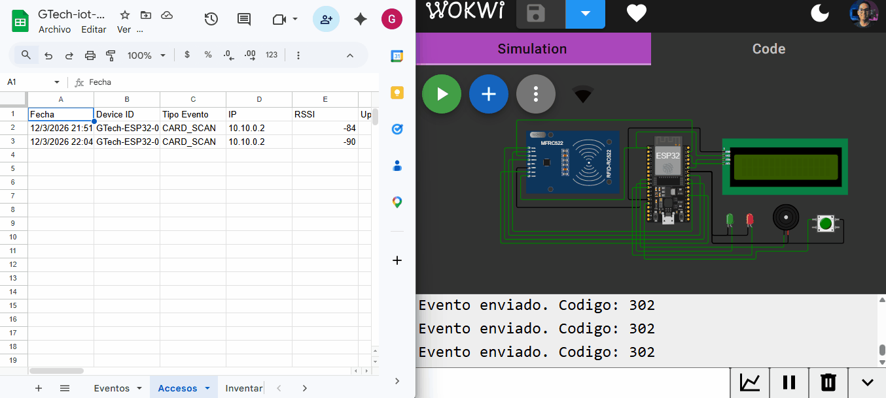

# IoT RFID Access Control System (ESP32)

[](https://www.espressif.com/)
[](https://www.arduino.cc/)
[](https://wokwi.com/)
[](https://developers.google.com/apps-script)
[](https://sheets.google.com/)
[](LICENSE)
[](https://guillermosoftwareengineer.github.io/esp32-rfid-iot-telemetry/)

## What is this project?

An IoT access control system based on RFID, simulated in **Wokwi** using an **ESP32**. The device reads RFID cards, validates authorization locally, and reports every event to a serverless cloud backend in real time.

The system replicates the exact operational flow of an enterprise attendance control device: provisioning, connectivity monitoring, remote diagnostics, and technical reporting — all without paid infrastructure.

---

## Documentation

| Language | README | Architecture |
|----------|--------|--------------|
| 🇺🇸 English | [README_en.md](README_en.md) | [docs/architecture_en.md](docs/architecture_en.md) |
| 🇪🇸 Español | [README_es.md](README_es.md) | [docs/architecture_es.md](docs/architecture_es.md) |

---

## System Demo



Complete workflow: RFID card scan → HTTP POST → Google Apps Script → Google Sheets



---

## System Architecture

```
[Wokwi / ESP32]  →  HTTP POST  →  [Google Apps Script]  →  [Google Sheets]
```


---

## Credentials Setup (IMPORTANT)

This project uses a **secrets file** pattern to keep credentials out of version control.

```bash
# 1. Clone the repository
git clone https://github.com/guillermosoftwareengineer/iot-rfid-esp32.git

# 2. Create your secrets file from the template
cp firmware/esp32-rfid/secrets.example.h firmware/esp32-rfid/secrets.h

# 3. Edit secrets.h with your real values
```

`secrets.h` is listed in `.gitignore` and will **never** be committed. The repository only contains `secrets.example.h` as a safe template.

See [README_es.md](README_es.md) for full setup instructions (Google Apps Script deployment, Wokwi simulation, etc.).

---

## Technology Stack

| Layer           | Technology              |
|-----------------|-------------------------|
| Simulation      | Wokwi                   |
| Microcontroller | ESP32 DevKit C v4       |
| RFID Reader     | MFRC522 (SPI)           |
| Display         | LCD 16x2 I2C            |
| Communication   | HTTP REST over WiFi     |
| Backend         | Google Apps Script      |
| Database        | Google Sheets           |
| Firmware        | Arduino Framework (C++) |

---

## Repository Structure

```
iot-rfid-esp32/
│
├── firmware/
│   └── esp32-rfid/
│       ├── esp32-rfid.ino       ← Main ESP32 firmware logic
│       ├── secrets.example.h    ← Credentials template (safe to commit)
│       └── .gitignore           ← Ignores build artifacts and local secrets
│
├── backend/
│   ├── Código.js                ← Google Apps Script logic (doGet + doPost)
│   ├── appsscript.json          ← Apps Script project manifest
│   └── .clasp.json              ← Configuration for clasp management
│
├── Dashboard HTMLJS/
│   └── images/                  ← Visual assets for the dashboard
│       ├── favicon.png
│       └── logo.png
│
├── diagrams/
│   ├── diagram.json             ← Wokwi circuit diagram configuration
│   └── *.png / *.gif            ← Architecture diagrams and visual demos
│
├── docs/
│   ├── architecture_en.md       ← Architecture documentation (English)
│   └── architecture_es.md       ← Architecture documentation (Spanish)
│
├── hardware/
│   ├── BOM.md                   ← Bill of Materials
│   └── wiring-diagram-v1.jpg    ← Physical wiring and connection diagram
│
├── comprensionAcademica/        ← Additional learning and testing resources
│   ├── Código.js
│   └── sketchComprension.ino
│
├── tests/
│   └── payload-samples.json     ← Sample JSON payloads for API testing
│
├── index.html                   ← Web dashboard (main entry point)
├── Iotv1.drawio                 ← Original editable architecture diagram
├── LICENSE                      ← Project license
├── .gitignore                   ← Global git ignore rules
├── README.md                    ← Main project documentation
├── README_en.md                 ← README in English
└── README_es.md                 ← README in Spanish
```
---

## Backend API

| Endpoint | Method | Description |
|----------|--------|-------------|
| `/exec` | `POST` | Receives events from ESP32 (CARD_SCAN, HEARTBEAT, DIAGNOSTIC) |
| `/exec` | `GET` | Returns device inventory — consumed by the dashboard |

See [README_en.md](README_en.md) for full API documentation.

---

## License

MIT License — See [LICENSE](LICENSE)

---

*Portfolio project — Guillermo Vásquez*  
*IoT Engineering · Google Apps Script · ESP32 · RFID*
