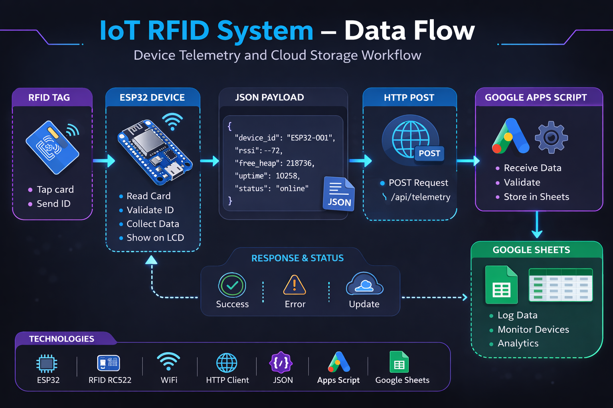
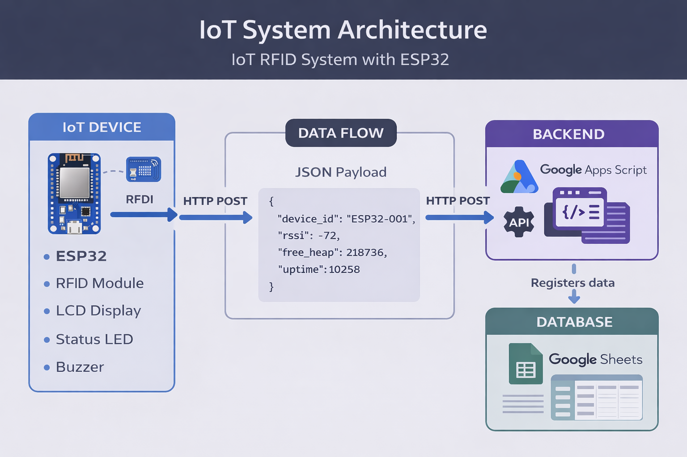
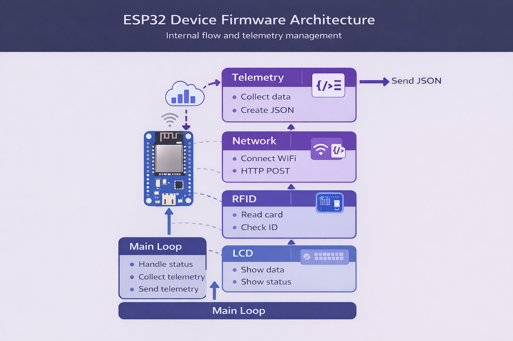

# ESP32 RFID IoT System

IoT diagnostic and device monitoring project built with **ESP32**, **RFID**, and **Google Apps Script** as a serverless backend.

The goal of this project is to demonstrate a functional IoT architecture capable of:

* Identifying devices using RFID
* Sending device telemetry
* Storing information in the cloud
* Monitoring device connectivity status

---

# System Architecture

The system is composed of three main components.

## 1. IoT Device

Hardware responsible for identification and data transmission.

Components used:

* ESP32
* RFID RC522 reader
* LCD 16x2 display
* Status LEDs
* Buzzer

The device reads an RFID card, collects diagnostic information, and sends the data to the backend using WiFi.

---

# IoT System Architecture

The overall architecture of the system follows this flow:

RFID → ESP32 → WiFi → HTTP API → Google Apps Script → Google Sheets

This allows IoT devices to send telemetry directly to the cloud using a **serverless backend architecture**.

---

# Device Firmware Architecture

The ESP32 firmware is organized into modules responsible for:

* Reading RFID cards
* Managing WiFi connectivity
* Building JSON messages
* Sending HTTP requests
* Monitoring device health and status

---

# Backend

The backend is implemented using **Google Apps Script**, acting as a serverless HTTP API.

Backend responsibilities:

* Receive HTTP requests from the device
* Validate incoming data
* Store information in Google Sheets

---

# Database

Data storage is handled using **Google Sheets**.

This enables:

* Logging system events
* Visualizing device telemetry
* Monitoring activity in real time

---

# Data Sent by the Device

The ESP32 sends diagnostic information in **JSON format**, including:

* `device_id`
* `ip`
* `rssi`
* `free_heap`
* `uptime`
* `estado`

These metrics allow monitoring of the operational status of the device.

---

# Device States

The system defines three main states:

**ONLINE**
The device is connected and sending data successfully.

**OFFLINE**
The device stopped reporting activity.

**ERROR**
A failure occurred in the device or communication.

---

# Technologies Used

## Hardware

* ESP32
* RFID RC522
* LCD 16x2

## Software

* Arduino Framework
* Google Apps Script
* HTTPClient
* JSON

---

# Project Goal

This project is part of a technical portfolio focused on:

* Internet of Things (IoT)
* System architecture
* Hardware–cloud integration
* Device monitoring systems
* Embedded systems connected to cloud services

---

# License

This project is released under the **MIT License**.
