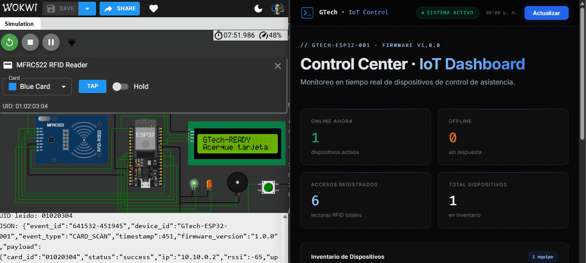
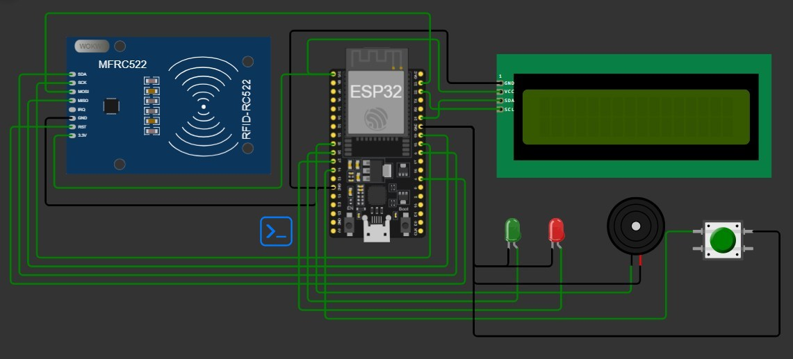

# IoT RFID Access Control System (ESP32)

[](https://www.espressif.com/)
[](https://www.arduino.cc/)
[](https://wokwi.com/)
[](https://developers.google.com/apps-script)
[](https://sheets.google.com/)
[](LICENSE)

---

## What is this project?

An IoT access control system based on RFID, simulated in **Wokwi** using an **ESP32**. The device acts as an access machine: it reads RFID cards, validates their authorization, and reports every event to a cloud backend.

The backend is completely **serverless**: a **Google Apps Script** exposed as a Web App that receives HTTP POST events from the ESP32 and stores them in **Google Sheets**. Additionally, a **Live Web Dashboard** (`index.html`) consumes this data via a REST API (`doGet`) to provide real-time monitoring of devices and access logs.

---

## System Architecture

```
  [Wokwi / ESP32]               [Web Dashboard (index.html)]
 (esp32-rfid.ino)                (Auto-refresh every 30s)
         │                                  │
         │ HTTP POST (JSON)                 │ HTTP GET (doGet)
         │                                  │
         ▼                                  ▼
      [Google Apps Script Web App (backend/Código.js)]
                           │
                           │ SpreadsheetApp API
                           ▼
                    [Google Sheets]
  ├── Accesos    → CARD_SCAN events
  ├── Eventos    → HEARTBEAT and DIAGNOSTIC events
  ├── Inventario → current status of each device
  └── Logs       → server errors
```

### RFID Event Flow

1. The ESP32 detects an RFID card using the RC522 module.
2. It reads the card's UID and converts it to hexadecimal.
3. It verifies the UID against the local database of authorized cards.
4. It displays the result on the LCD (`ACCESO OK` / `ACCESO DENEGADO`).
5. It emits a short beep (authorized) or a long beep (denied).
6. It sends a `CARD_SCAN` event to the backend via HTTP POST.
7. Google Apps Script logs the event and updates the inventory in Google Sheets.
8. The Web Dashboard (`index.html`) reflects the event in real time via auto-refresh every 30 seconds (`doGet`).

### Heartbeat (Life Signal)

Every 30 seconds, the ESP32 automatically sends a `HEARTBEAT` event to the backend, indicating that the device is still active. This allows for disconnection detection.

---

## Live Dashboard

**[→ Open live dashboard](https://guillermosoftwareengineer.github.io/esp32-rfid-iot-telemetry/)**



Real-time monitoring of connected devices. The dashboard reads from Google Sheets via `doGet` and auto-refreshes every 30 seconds.

---

## Technologies

| Layer | Technology | Role |
| :--- | :--- | :--- |
| Simulation | Wokwi | Simulates the ESP32 and peripherals |
| Microcontroller | ESP32 DevKit C v4 | Central unit of the IoT device |
| RFID Reader | MFRC522 (SPI) | Reads RFID cards / tags |
| Display | LCD 16x2 I2C | Shows status and user feedback |
| Communication | HTTP REST over WiFi | Sends events to the backend |
| Backend | Google Apps Script | Serverless API (`doPost` / `doGet`) |
| Database | Google Sheets | Stores events, inventory, and logs |
| Frontend | HTML, CSS, Vanilla JS | Live Web Dashboard for real-time monitoring |
| FW Framework | Arduino (C++) | Base of the ESP32 firmware |

---

## Repository Structure

```
iot-rfid-esp32/
│
├── firmware/
│   └── esp32-rfid/
│       ├── esp32-rfid.ino       ← Main ESP32 firmware logic
│       ├── secrets.example.h    ← Credentials template (safe to commit)
│       └── .gitignore           ← Ignores build artifacts and local secrets
│
├── backend/
│   ├── Código.js                ← Google Apps Script logic (doGet + doPost)
│   ├── appsscript.json          ← Apps Script project manifest
│   └── .clasp.json              ← Configuration for clasp management
│
├── Dashboard HTMLJS/
│   └── images/                  ← Visual assets for the dashboard
│       ├── favicon.png
│       └── logo.png
│
├── diagrams/
│   ├── diagram.json             ← Wokwi circuit diagram configuration
│   └── *.png / *.gif            ← Architecture diagrams and visual demos
│
├── docs/
│   ├── architecture_en.md       ← Architecture documentation (English)
│   └── architecture_es.md       ← Architecture documentation (Spanish)
│
├── hardware/
│   ├── BOM.md                   ← Bill of Materials
│   └── wiring-diagram-v1.jpg    ← Physical wiring and connection diagram
│
├── comprensionAcademica/        ← Additional learning and testing resources
│   ├── Código.js
│   └── sketchComprension.ino
│
├── tests/
│   └── payload-samples.json     ← Sample JSON payloads for API testing
│
├── index.html                   ← Web dashboard (main entry point)
├── Iotv1.drawio                 ← Original editable architecture diagram
├── LICENSE                      ← Project license
├── .gitignore                   ← Global git ignore rules
├── README.md                    ← Main project documentation
├── README_en.md                 ← README in English
└── README_es.md                 ← README in Spanish
```

---

## Credentials Management (IMPORTANT)

This project uses a **secrets file** system to prevent exposing credentials in the repository. The Google Apps Script URL and the Sheet ID **must never be in the source code**.

### How it works

| File | Committed? | Purpose |
| :--- | :--- | :--- |
| `secrets.example.h` | Yes | Template with safe example values |
| `secrets.h` | No (gitignore) | Real developer credentials |

The firmware includes `secrets.h` via `#include "secrets.h"`. If that file does not exist, the compilation fails with a clear message. This is intentional: it forces each collaborator to configure their own credentials.

### First-time Setup

```bash
# 1. Clone the repository
git clone https://github.com/tu-usuario/iot-rfid-esp32.git
cd iot-rfid-esp32

# 2. Create the secrets file
cp firmware/esp32-rfid/secrets.example.h firmware/esp32-rfid/secrets.h

# 3. Edit secrets.h with your real values
# Open firmware/esp32-rfid/secrets.h and replace the placeholder values
```

### Content of `secrets.h`

```cpp
#ifndef SECRETS_H
#define SECRETS_H

// WiFi Network
// For Wokwi: "Wokwi-GUEST" with empty password
#define SECRET_WIFI_SSID     "Wokwi-GUEST"
#define SECRET_WIFI_PASSWORD ""

// URL of the Google Apps Script published as a Web App
#define SECRET_BACKEND_URL   "https://script.google.com/macros/s/YOUR_SCRIPT_ID/exec"

// Google Sheet ID (visible in the spreadsheet URL)
#define SECRET_SHEET_ID      "YOUR_SHEET_ID"

#endif
```

---

## Backend Setup (Google Apps Script)

### Step 1 — Create the Google Sheet

1. Go to [Google Sheets](https://sheets.google.com) and create a new spreadsheet.
2. Copy the ID from the URL: `docs.google.com/spreadsheets/d/`**`YOUR_SHEET_ID`**`/edit`
3. The script will automatically create the sheets: **Accesos**, **Eventos**, **Inventario**, **Logs**.

### Step 2 — Create the Apps Script

1. In the spreadsheet: **Extensions → Apps Script**.
2. Delete the default content.
3. Paste the content of `backend/Código.js`.
4. Save with `Ctrl+S`.

### Step 3 — Deploy as Web App

1. **Deploy → New deployment**.
2. Type: **Web app**.
3. Execute as: **Me (your Google account)**.
4. Who has access: **Anyone**.
5. Click **Deploy**.
6. Copy the generated URL (ends in `/exec`).
7. Paste it in `secrets.h` as the value for `SECRET_BACKEND_URL`.

> **Note:** Every time you modify the script and redeploy, a new version is generated. If the URL changes, update `secrets.h`.

---

## Simulate in Wokwi

### Requirements

- Account on [wokwi.com](https://wokwi.com)
- The `diagrams/diagram.json` file with the circuit
- The firmware `firmware/esp32-rfid/esp32-rfid.ino`

### Steps

1. Create a new ESP32 project in Wokwi.
2. Import `diagram.json` or recreate the circuit manually.
3. Copy the content of `esp32-rfid.ino` to the Wokwi editor.
4. In Wokwi, **`secrets.h` is not used** — WiFi values are pre-configured for `Wokwi-GUEST`.
5. Update the `BACKEND_URL` constant directly in the Wokwi editor with your real URL.

> **In Wokwi**, the `Wokwi-GUEST` WiFi network is a virtual network without a password that provides internet access. The simulated ESP32 can make real HTTP requests to Google Apps Script.



---

## Hardware Connections

| Component | Pin/Signal | ESP32 GPIO |
| :--- | :--- | :--- |
| RFID RC522 | SDA (SS) | GPIO 5 |
| RFID RC522 | SCK | GPIO 18 |
| RFID RC522 | MOSI | GPIO 23 |
| RFID RC522 | MISO | GPIO 19 |
| RFID RC522 | RST | GPIO 4 |
| RFID RC522 | VCC | 3.3V |
| LCD 16x2 I2C | SDA | GPIO 21 |
| LCD 16x2 I2C | SCL | GPIO 22 |
| Green LED | Anode | GPIO 26 |
| Red LED | Anode | GPIO 27 |
| Buzzer | Signal | GPIO 25 |
| Button | Signal | GPIO 14 |

---

## Backend API

### `POST /exec` — Receive event from ESP32

**JSON Body:**
```json
{
  "device_id": "GTech-ESP32-001",
  "event_type": "CARD_SCAN",
  "token": "YOUR_API_TOKEN",
  "firmware_version": "1.0.0",
  "payload": {
    "card_id": "01020304",
    "status": "success",
    "ip": "10.10.0.2",
    "rssi": -72,
    "uptime": 47
  }
}
```

**Event Types (`event_type`):**
- `CARD_SCAN` → RFID card read (authorized or not)
- `HEARTBEAT` → Periodic life signal (every 30 s)
- `DIAGNOSTIC_RESPONSE` → Diagnostic report via button

**Successful Response:**
```json
{ "status": "success" }
```

### `GET /exec` — Get device inventory

Returns the current status of all registered devices. Used by the Web Dashboard.

```json
{
  "dispositivos": [
    {
      "device_id": "GTech-ESP32-001",
      "ultima_conexion": "2026-04-21T21:00:00.000Z",
      "ip": "10.10.0.2",
      "rssi": -72,
      "estado": "ONLINE"
    }
  ]
}
```

---

## Authorized Cards (Local Database)

The firmware has a local list of authorized UIDs. This allows the system to work even without an internet connection (offline mode):

```cpp
String tarjetasAutorizadas[] = {
  "A1B2C3D4",
  "E5F6G7H8",
  "12345678",
  "01020304"   // default test card in Wokwi
};
```

The default test card in Wokwi is `01020304`.

---

## License

MIT License — See [LICENSE](LICENSE)

---

*Technical Portfolio Project — Guillermo Vásquez*  
*IoT Engineering · Google Apps Script · ESP32 · RFID*
