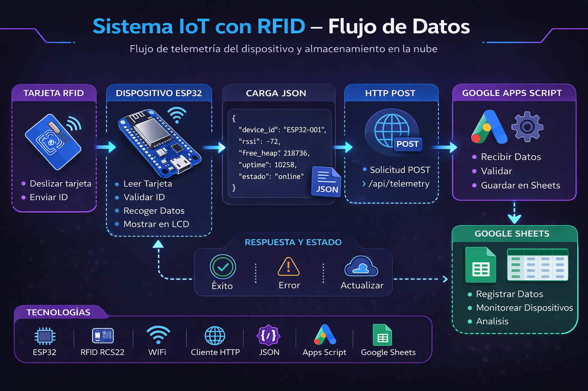
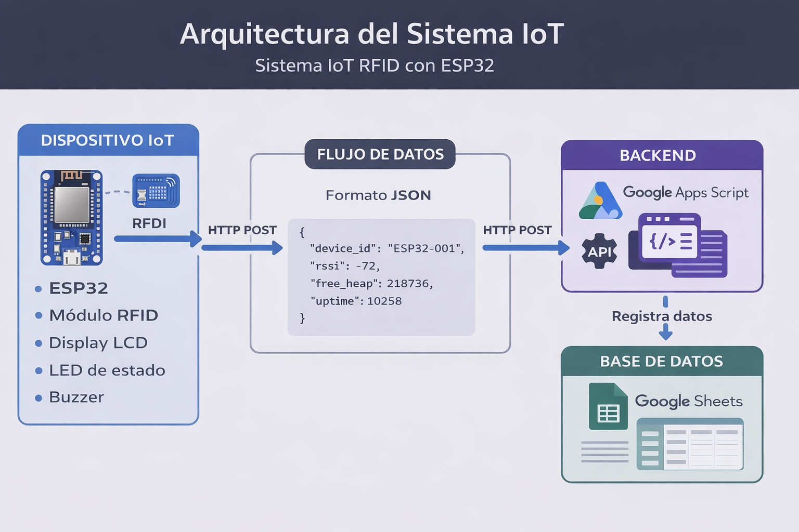
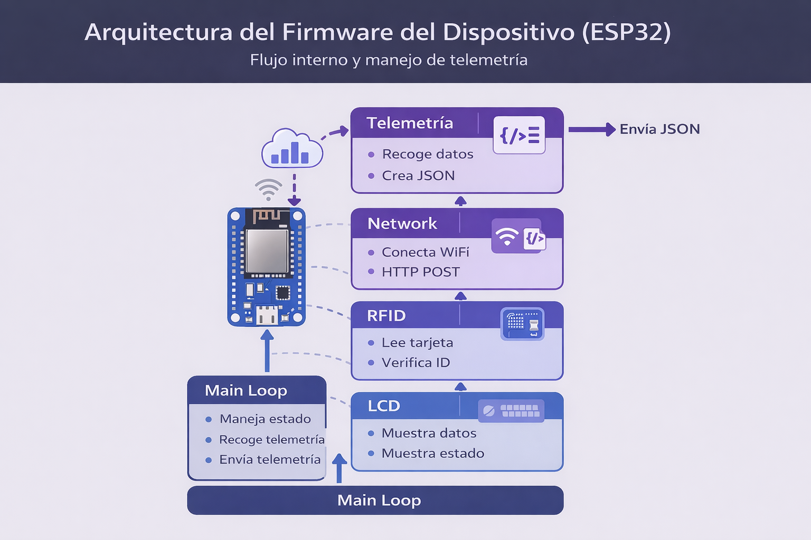

# Sistema IoT RFID con ESP32

Proyecto IoT de diagnóstico y monitoreo de dispositivos basado en **ESP32**, **RFID** y **Google Apps Script** como backend serverless.

El objetivo del proyecto es demostrar una arquitectura IoT funcional capaz de:

* Identificar dispositivos mediante RFID
* Enviar telemetría del dispositivo
* Registrar información en la nube
* Mostrar el estado de conexión de los dispositivos

---

# Arquitectura del sistema

El sistema está compuesto por tres componentes principales:

## 1. Dispositivo IoT

Hardware encargado de la identificación y envío de datos.

Componentes utilizados:

* ESP32
* Lector RFID RC522
* Pantalla LCD 16x2
* LEDs de estado
* Buzzer

El dispositivo lee una tarjeta RFID, obtiene información del sistema y envía datos al backend mediante WiFi.

---

# Arquitectura general del sistema IoT

La arquitectura completa del sistema sigue el siguiente flujo:

RFID → ESP32 → WiFi → API HTTP → Google Apps Script → Google Sheets

Esto permite que los dispositivos envíen telemetría directamente a la nube utilizando un backend serverless.

---

# Arquitectura del firmware del dispositivo

El firmware del ESP32 está organizado en módulos responsables de:

* Lectura de tarjetas RFID
* Gestión de conectividad WiFi
* Construcción de mensajes JSON
* Envío de datos mediante HTTP
* Monitoreo del estado del dispositivo

---

# Backend

El backend del sistema está implementado con **Google Apps Script**, funcionando como una API HTTP serverless.

Responsabilidades del backend:

* Recibir solicitudes HTTP del dispositivo
* Validar los datos recibidos
* Registrar la información en Google Sheets

---

# Base de datos

El almacenamiento de datos se realiza utilizando **Google Sheets**.

Esto permite:

* Registrar eventos del sistema
* Visualizar telemetría de dispositivos
* Monitorear actividad en tiempo real

---

# Datos enviados por el dispositivo

El ESP32 envía información diagnóstica en formato **JSON**, incluyendo:

* `device_id`
* `ip`
* `rssi`
* `free_heap`
* `uptime`
* `estado`

Estos datos permiten evaluar el estado operativo del dispositivo.

---

# Estados del dispositivo

El sistema utiliza tres estados principales:

**ONLINE**
El dispositivo está conectado y enviando datos correctamente.

**OFFLINE**
El dispositivo dejó de reportar actividad.

**ERROR**
Ocurrió una falla en el dispositivo o en la comunicación.

---

# Tecnologías utilizadas

## Hardware

* ESP32
* RFID RC522
* LCD 16x2

## Software

* Arduino Framework
* Google Apps Script
* HTTPClient
* JSON

---

# Objetivo del proyecto

Este proyecto forma parte de un portafolio técnico orientado a:

* Internet of Things (IoT)
* Arquitectura de sistemas
* Integración hardware–cloud
* Monitoreo de dispositivos
* Desarrollo de soluciones embebidas conectadas a la nube

---

# Licencia

Este proyecto está publicado bajo la **Licencia MIT**.
