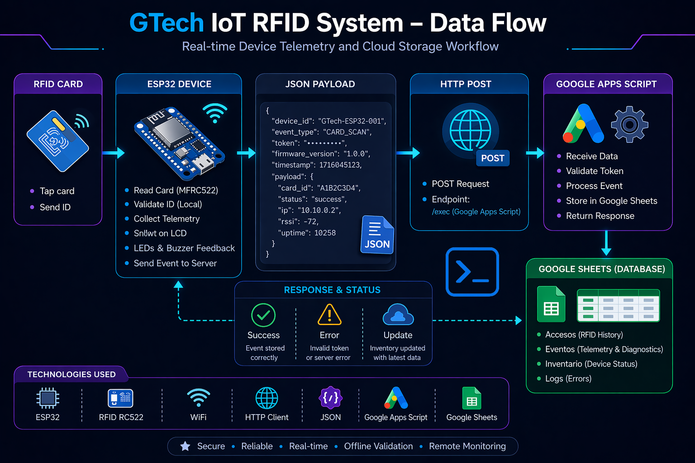
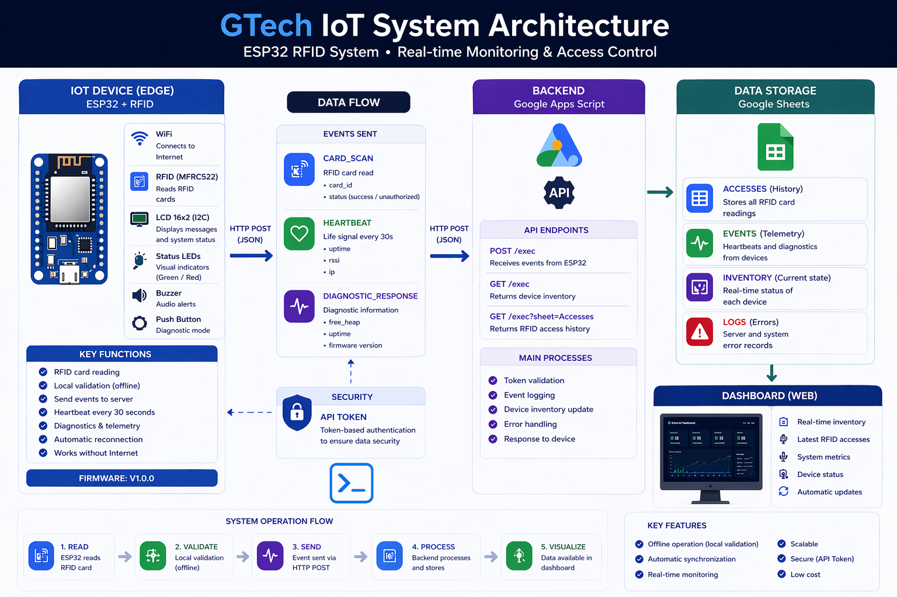
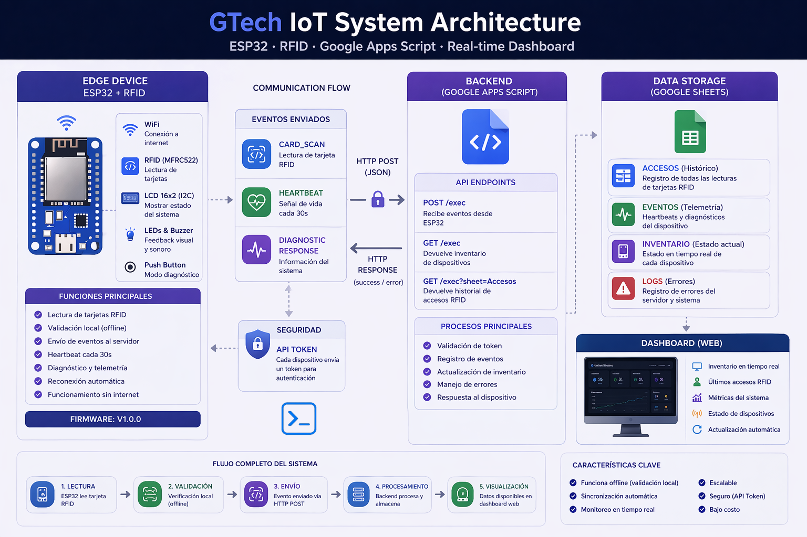

# RFID IoT System Architecture

## Overview

The system implements a lightweight IoT architecture using:

* **ESP32** as the IoT device
* **Google Apps Script** as a serverless backend
* **Google Sheets** as the data storage layer
* **Web Dashboard** as the frontend monitoring interface

This architecture allows building functional IoT systems without requiring dedicated servers or complex infrastructure.

---

# System Architecture

The system is organized into four main layers:

1. **IoT Device**
2. **Serverless Backend**
3. **Data Storage**
4. **Web Dashboard (Frontend)**

The device collects system information and sends it to the backend using HTTP requests, while the dashboard consumes this data for real-time monitoring.

---

# IoT Architecture

The overall architecture follows this data flow:

* **Data Acquisition (Write):** RFID → ESP32 → WiFi → HTTP API (doPost) → Google Apps Script → Google Sheets
* **Data Visualization (Read):** Web Dashboard → HTTP API (doGet) → Google Apps Script → Google Sheets

This approach allows IoT devices to communicate directly with cloud services using a **serverless architecture**, and enables a decoupled frontend to consume the data.

---

# Device Firmware Architecture

The ESP32 firmware is structured into modules responsible for:

* RFID card reading
* WiFi connectivity management
* JSON message construction
* HTTP request transmission
* Device health and status monitoring

This modular design improves maintainability and scalability.

---

# Data Flow

The system data flow occurs in the following steps:

**Data Acquisition & Storage:**
1. The ESP32 gathers diagnostic information from the device:

   * RSSI (WiFi signal strength)
   * available memory (`free_heap`)
   * device uptime (`uptime`)
   * IP address

2. The device generates a **JSON payload** containing the collected information.

3. The ESP32 sends the data through an **HTTP POST request** to the backend.

4. **Google Apps Script** receives the request.

5. The data is stored in **Google Sheets**.

**Data Visualization:**
6. The **Web Dashboard** periodically sends an **HTTP GET request** to the backend.
7. Google Apps Script reads the latest inventory and access logs from Google Sheets.
8. The backend returns a JSON response which the dashboard renders in real-time.

This pipeline enables centralized monitoring of IoT devices.

---

# System Components

## IoT Device

Hardware components used:

* ESP32
* RFID RC522
* LCD display
* Status LEDs
* Buzzer

Device responsibilities:

* Read RFID cards
* Display information on the LCD
* Collect system diagnostics
* Send telemetry to the backend

---

## Backend

The backend is implemented using **Google Apps Script**, acting as a serverless HTTP API.

Main responsibilities:

* receive HTTP requests
* validate incoming data
* store records in Google Sheets

---

## Database

**Google Sheets** functions as a lightweight database.

It allows:

* storing device telemetry
* visualizing system logs
* monitoring device activity

---

## Web Dashboard (Frontend)

A static single-page application (`index.html`) that serves as the monitoring interface.

Main responsibilities:

* fetch real-time data from the backend via HTTP GET (`doGet`)
* visualize device inventory and connection status
* display the latest RFID access logs
