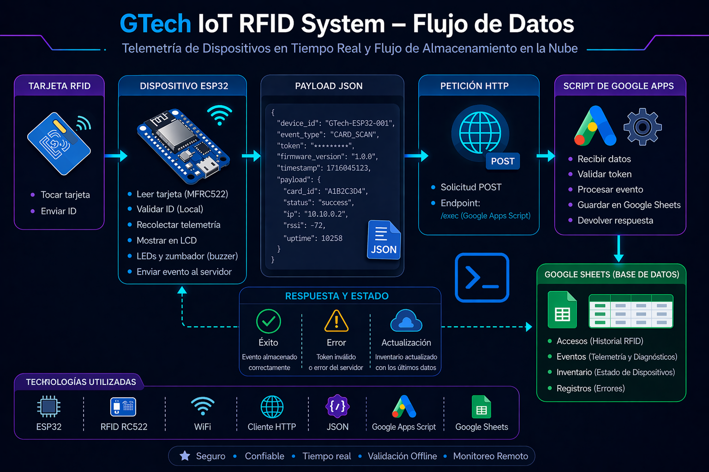
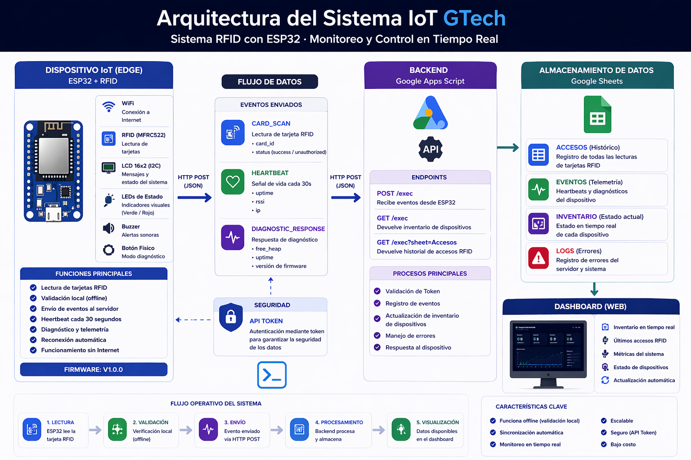
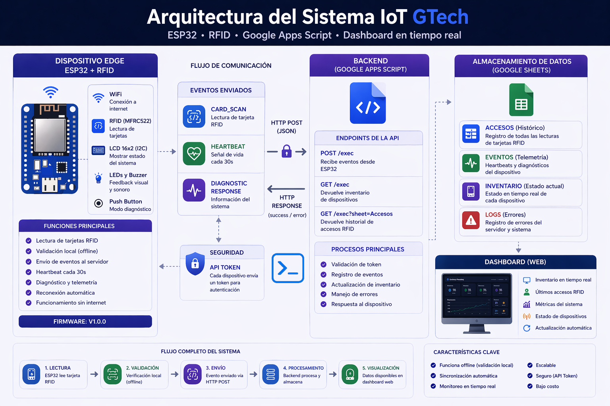

# Arquitectura del sistema IoT RFID

## Visión general

El sistema implementa una arquitectura IoT ligera utilizando:

* **ESP32** como dispositivo IoT (simulado en Wokwi)
* **Google Apps Script** como backend serverless
* **Google Sheets** como almacenamiento de datos
* **Web Dashboard** (`index.html`) como interfaz de monitoreo en tiempo real
* **Generador de informes PDF** (`generate_report.py`) como herramienta de análisis offline

Esta arquitectura permite construir sistemas IoT funcionales sin necesidad de servidores dedicados ni infraestructura compleja. El backend actúa como API central que sirve tanto al dashboard web como al generador de informes.

---

# Arquitectura del sistema



El sistema se organiza en cinco capas principales:

1. **Dispositivo IoT** (Wokwi / ESP32)
2. **Backend serverless** (Google Apps Script)
3. **Almacenamiento de datos** (Google Sheets)
4. **Web Dashboard** (GitHub Pages — `index.html`)
5. **Generador de informes** (`reports/generate_report.py`)

El dispositivo envía telemetría al backend mediante HTTP POST. Tanto el dashboard web como el script de reportes consumen los datos del backend de forma independiente mediante HTTP GET (`doGet`).

---

# Arquitectura IoT



La arquitectura general del sistema sigue el siguiente flujo:

```
                         ESCRITURA
Wokwi (ESP32) ──POST + token──► Apps Script (doPost) ──► Google Sheets
                                                                │
                         LECTURA                               │
                    ◄──── Apps Script (doGet) ◄────────────────┘
                                    │
              ┌─────────────────────┴─────────────────────┐
              ▼                                           ▼
  GitHub Pages (index.html)                 generate_report.py
    Dashboard web en tiempo real             Script local Python
    Auto-refresh cada 30 s                  Genera informes PDF
```

* **Adquisición de Datos (Escritura):** RFID → ESP32 → WiFi → HTTP POST (+ token) → Google Apps Script → Google Sheets
* **Visualización en tiempo real (Lectura):** GitHub Pages Dashboard → HTTP GET (`doGet`) → Google Apps Script → Google Sheets
* **Generación de informes (Lectura):** `generate_report.py` → HTTP GET (`doGet`) → Google Apps Script → Google Sheets → PDF

Este enfoque permite implementar soluciones IoT utilizando únicamente servicios cloud serverless, con múltiples clientes consumiendo el mismo endpoint de lectura de forma desacoplada.

---

# Arquitectura del Firmware del Dispositivo



El firmware del ESP32 está estructurado en módulos que gestionan:

* lectura de tarjetas RFID
* conectividad WiFi
* construcción de mensajes JSON
* envío de datos mediante HTTP
* monitoreo del estado del dispositivo

Esta organización facilita la modularidad y el mantenimiento del código.

---

# Flujo de datos

El flujo de datos del sistema ocurre en los siguientes pasos:

**Adquisición y Almacenamiento de Datos:**
1. El ESP32 detecta una tarjeta RFID y verifica su UID contra la base de datos local.

2. El dispositivo genera un **payload JSON** con el resultado del acceso y telemetría del sistema:

   * RSSI (intensidad de señal WiFi)
   * memoria libre (`free_heap`)
   * tiempo de actividad (`uptime`)
   * dirección IP

3. El ESP32 envía los datos mediante una solicitud **HTTP POST** al backend, incluyendo un **token de autenticación**.

4. **Google Apps Script** valida el token y rechaza la escritura si no coincide.

5. Los datos se registran en **Google Sheets** en las hojas: `Accesos`, `Eventos`, `Inventario` y `Logs`.

**Visualización en tiempo real (Web Dashboard):**

6. El **Web Dashboard** (`index.html` en GitHub Pages) envía periódicamente una solicitud **HTTP GET** (`doGet`) al backend.
7. Google Apps Script lee el inventario y los registros de acceso desde Google Sheets.
8. El backend devuelve una respuesta JSON que el dashboard renderiza en tiempo real (auto-refresh cada 30 s).

**Generación de informes PDF (generate_report.py):**

9. El script local `generate_report.py` realiza el mismo `doGet` al backend que el dashboard.
10. Obtiene el inventario de dispositivos y el historial de accesos RFID.
11. Genera un **informe técnico en PDF** con métricas, tablas y gráficos de actividad.
12. El PDF se guarda localmente (excluido del repositorio por `.gitignore`).

Este flujo permite monitorear dispositivos IoT de forma centralizada, con múltiples herramientas de visualización que comparten el mismo backend.

---

# Componentes del sistema

## Dispositivo IoT

Hardware utilizado:

* ESP32
* RFID RC522
* LCD
* LEDs
* Buzzer

Responsabilidades del dispositivo:

* Leer tarjetas RFID
* Mostrar información en la pantalla LCD
* Recopilar datos del sistema
* Enviar telemetría al backend

---

## Backend

El backend está implementado utilizando **Google Apps Script**, funcionando como una API HTTP serverless.

Funciones principales:

* recibir solicitudes HTTP
* validar datos enviados por el dispositivo
* registrar información en Google Sheets

---

## Base de datos

**Google Sheets** funciona como una base de datos ligera.

Permite:

* almacenar telemetría del dispositivo
* visualizar registros de actividad
* monitorear el estado de los dispositivos

---

## Web Dashboard (Frontend)

Una aplicación de página única estática (`index.html`) desplegada en **GitHub Pages** que sirve como interfaz de monitoreo.

Funciones principales:

* obtener datos en tiempo real del backend mediante HTTP GET (`doGet`)
* visualizar el inventario de dispositivos y su estado de conexión
* mostrar los últimos registros de acceso RFID
* auto-refresh automático cada 30 segundos

---

## Generador de Informes PDF

Un script Python local (`reports/generate_report.py`) que actúa como cliente independiente del mismo backend.

Funciones principales:

* consultar el mismo `doGet` del backend que usa el dashboard
* analizar el inventario de dispositivos y el historial de accesos
* generar un **informe técnico en PDF** con métricas, gráficos y tablas
* operar en modo `--demo` sin necesidad de internet

El PDF generado se excluye del repositorio mediante `.gitignore`.
